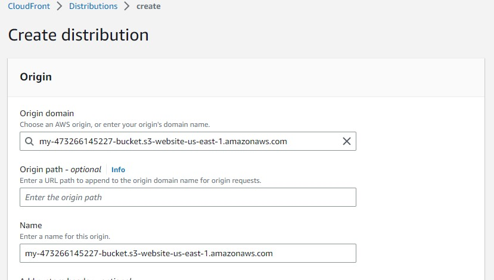
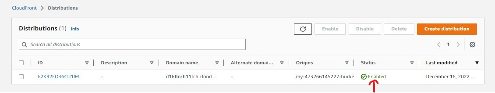

# udacity_project_one

static website deployment on AWS S3 and configuring content delivery network using cloudfront

The cloud is perfect for hosting static websites that only include HTML, CSS, and JavaScript files that require no server-side processing. The whole project has two major intentions to implement:

- Hosting a static website on S3 and
- Accessing the cached website pages using CloudFront content delivery network (CDN) service.

<h3>TASKS</h3>

- Create a public S3 bucket and upload the website files to your bucket.
- Configure the bucket for website hosting and secure it using IAM policies.
- Speed up content delivery using AWS’s content distribution network service, CloudFront.
- Access your website in a browser using the unique CloudFront endpoint.

<h3>STEPS</h3>

## 1. Create an s3 bucket

Log into your aws account. Click on services and scroll down to storage. Click on it and you will see s3 on the right  

Click on create bucket

## 2. General configuration

- In the General configuration, enter a “Bucket name” and a region of your choice. Note: Bucket names must be globally unique.
- One of the convenient naming conventions is my-123456789-bucket, where you can replace 123456789 with your 12 digit AWS account ID

## 3. Bucket settings for Block Public Access

In the Bucket settings for Block Public Access section, uncheck the “Block all public access”. It will enable the public access to the bucket objects via the S3 object URL.  
We are allowing the public access to the bucket contents because we are going to host a static website in this bucket. Hosting requires the content should be publicly readable.
  
You tick the acknowledgement box

## 4. Bucket versioning and Encryption

Bucket version should be disabled as it encrypt files been stored in a bucket

Scroll down and create bucket

The snapshot below shows that the bucket is in the Region: US East (N. Virginia) us-east-1 with its creation date.  
Click on the radio button and click on the bucket name

## 4. Upload files to S3 bucket

Click on the upload button to upload files.

Click "Add files" to upload the index.html file, and click "Add folder" to upload the css, img, and vendor folders.

Go the udacity-starter-website and upload it's content one after the other

The files have all been uploaded

## 5. Secure Bucket via IAM

- Click on the “Permissions” tab, note that the access is showing 'objects can be public'
- Scroll down to the “Bucket Policy” section which shows it is empty. Click on the Edit button.
- 

- Edit the bucket policy as shown below

    
  

The access is now showing as public  
 You will see warnings about making your bucket public, but this step is required for static website hosting.

## 6. Enabling static website hosting

- Go to the Properties tab and then scroll down to edit the Static website hosting section.

    
  

- Click on the “Edit” button to see the Edit static website hosting screen.
- Now, enable the Static website hosting, and write the name of yout html file in the index document and also write same for the error document

  

- you notice that enabling the static website hosting requires the bucket to be public. In the snapshot above, it says "For your customers to access the content at the website endpoint, you must make all your content publicly readable.
- When our S3 Bucket is Enabled, We can test our endpoint using the Bucket Website Endpoint url as shown on the images below.

  

## 7. Create Distribution

- We create a cloudfront distribution and its located in the Networking and Content delivery services.
- By the right, you click on cloudfront.

  

- From the CloudFront dashboard, click “Create Distribution”

- For the origin domain don't select the bucket from the dropdown list. Paste the Static website hosting endpoint of the form which is my-473266145227-bucket.s3.amazonaws.com.

  

Redirect all HTTP request to HTTPS

- In the Default root object, we will write the name of the file i.e. index.html that we uploaded to our bucket.

- Leave the defaults for the rest of the options, and click “Create Distribution”. It may take up to 10 minutes for the CloudFront Distribution to get created

We can view our newly created OAI and see details such as distribution domain name, amazon resource name (arn).

Once the status of your distribution changes from “Deploying” to “Deployed”, copy the endpoint URL for your CloudFront distribution found in the “Domain Name” (https://d16flnrfi11fch.cloudfront.net) column and access it via a web browser.

